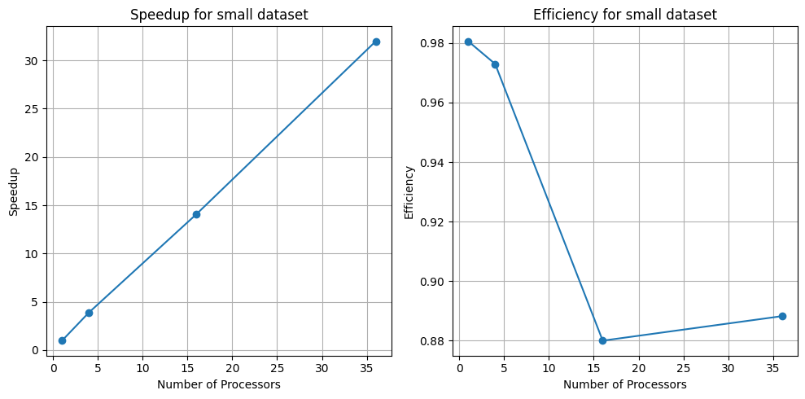

# EECS87 Parallel computing HW2

## Usage
run all tests on greatlake.
```
bash run.sh 
```

Example, `mpirun -np 36 --bind-to core:overload-allowed ./main 2000 500 0 1 > parallel-small-36.txt` run a (2000,500) with 36 core on without interdemiate detail with parallel mode and output to  parallel-small-36.txt.

```
mpirun -np [number of core] --bind-to core:overload-allowed ./main [m] [n] [verbose(1) or not(0)] [parallel(1) or serial(0)] > [output path]
```

## Methos
I crop the matrix into $p$ blocks and each part has size $(\frac{m}{sqrt(p)}, \frac{n}{sqrt(p)})$. Except for the blocks on the boundary, the inner blocks need to send its left col, right col, bottom row, up row and 4 corners to the neibours.
## Result
I have test the model with more different numbers of processor(more than the problem mentiond.)

### (2000,500)
|    |   Processors |   Time Used |         Sum |   Sum of Square |   Speedup |   Efficiency |
|---:|-------------:|------------:|------------:|----------------:|----------:|-------------:|
|  0 |            serial |   17.5563   | 3.00558e+07 |     6.8623e+09  |  1        |     1        |
|  1 |            1 |   18.0162   | 3.00558e+07 |     6.8623e+09  |  0.974473 |     0.974473 |
|  2 |            4 |    4.42072  | 3.0017e+07  |     6.86206e+09 |  3.97137  |     0.992842 |
|  3 |            9 |    4.07477  | 2.96926e+07 |     6.86021e+09 |  4.30854  |     0.478726 |
|  4 |           16 |    2.45964  | 2.99472e+07 |     6.86155e+09 |  7.13775  |     0.446109 |
|  5 |           25 |    1.59031  | 2.99214e+07 |     6.8614e+09  | 11.0395   |     0.441582 |
|  6 |           36 |    0.575489 | 2.93378e+07 |     6.85835e+09 | 30.5068   |     0.84741  |


### (1000,4000)
|    |   Processors |   Time Used |         Sum |   Sum of Square |   Speedup |   Efficiency |
|---:|-------------:|------------:|------------:|----------------:|----------:|-------------:|
|  0 |            serial |    70.3885  | 1.06397e+08 |     1.4104e+10  |  1        |     1        |
|  1 |            1 |    70.4324  | 1.06397e+08 |     1.4104e+10  |  0.999377 |     0.999377 |
|  2 |            4 |    17.6228  | 1.06476e+08 |     1.41044e+10 |  3.99417  |     0.998543 |
|  3 |            9 |    15.9951  | 1.06324e+08 |     1.41034e+10 |  4.40063  |     0.488959 |
|  4 |           16 |     9.15621 | 1.05891e+08 |     1.41016e+10 |  7.68751  |     0.48047  |
|  5 |           25 |     5.73636 | 1.05398e+08 |     1.40988e+10 | 12.2706   |     0.490823 |
|  6 |           36 |     1.99418 | 1.05441e+08 |     1.40994e+10 | 35.297    |     0.980471 |


### Scaling, Speedup and efficiency
From Strong Scaling perspective, we can see that the program is linear speedup but not perfect speedup since the efficiency is less than 1 as shown in the images above. I guess this maybe caused by the communication cost when the processor number goes up. So it's not perfect strong scaling.


From weak scaling perspective, we have scaling in terms of the size of the matrix, as well as in the number of processors. When we expand the matrix size 4 time, we compare the processor number parts like (1,4) (4,16) (9,36), we can see the running time is similar, so it's perfect weak scaling.